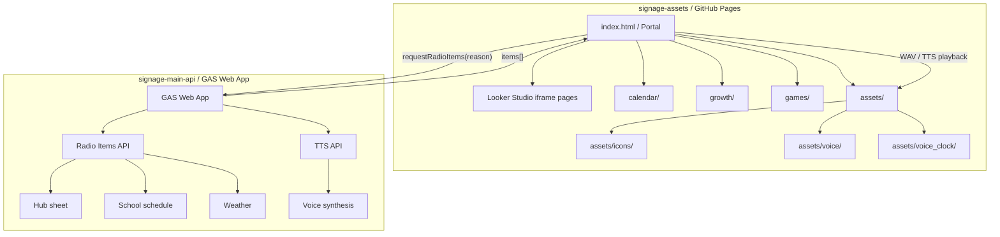

# Signage Architecture

This document summarizes the current structure of the home Signage Radio / Portal system.

## Overall Structure



Text view:

```text
signage-assets
  index.html
    ├─ Looker Studio iframe
    ├─ calendar/
    ├─ growth/
    ├─ games/
    └─ assets/

signage-main-api
  GAS Web App
    ├─ Radio Items API
    ├─ TTS API
    ├─ Hubシート
    ├─ 学校予定
    ├─ 天気
    └─ 音声生成
```

## Frontend Responsibilities

`signage-assets` is responsible for browser-side presentation and playback.

- Portal display in `index.html`.
- Full-screen iframe display for Looker Studio and local feature pages.
- Calling the Radio Items API with a `reason`.
- Playing the returned `items[]` queue.
- WAV playback from `assets/voice/` and `assets/voice_clock/`.
- TTS playback from base64 audio returned by the GAS API.
- Managing shared icon and audio assets under `assets/`.
- Providing navigation to feature pages such as `calendar/`, `growth/`, and `games/`.

## GAS Responsibilities

`signage-main-api` is responsible for server-side context assembly and API responses.

- Generating Radio Items based on `reason`.
- Mapping reasons to slots.
- Garbage collection guidance.
- School schedule guidance.
- Weather guidance.
- TTS generation through the TTS API path.
- Returning JSON API responses to the frontend.

## Published Pages

Current GitHub Pages public paths:

```text
/
calendar/
games/hissan/
games/othello/
growth/
schedule/
```

Notes:

- `/` is the main portal.
- `calendar/` is currently used by the portal's schedule button.
- `games/hissan/` is the default game page.
- `games/othello/` is linked from the game submenu.
- `growth/` is linked from the school submenu.
- `schedule/` exists as a directly accessible page, but it is not currently referenced by the portal. It is a legacy candidate.

## Future Organization Policy

```text
assets/  : 共通資産
calendar/: 家庭カレンダー
games/   : ゲーム
growth/  : 成長曲線
admin/   : 管理画面群。今後追加予定
legacy/  : 旧ページ退避候補
```

Planned `admin/` structure:

```text
admin/alarm/     出発タイマー設定
admin/settings/  サイネージ設定
admin/debug/     APIテスト・デバッグ
admin/radio/     Radioテンプレ管理
```

## Design Decisions

### Keep `index.html` as the display and playback center

`index.html` already owns portal navigation, iframe display, scheduled radio triggers, queue playback, WAV playback, TTS playback, and Cast-related playback. Keeping this as the presentation center avoids splitting time-sensitive browser behavior across multiple pages.

### Separate management screens into `admin/`

Management functions such as alarm settings, debug calls, and radio template editing have different users and interaction patterns from the signage display. Keeping them under `admin/` prevents operational tools from becoming mixed into the always-on portal surface.

### Keep shared audio and icons under `assets/`

The portal and feature pages need stable, public GitHub Pages URLs for PNG and WAV files. `assets/` should remain the common location for icons, notification audio, and clock audio.

### Keep the GAS `items[]` playback model

GAS should continue returning a structured `items[]` queue such as:

```json
[
  { "type": "wav", "key": "MORNING_SUMMARY" },
  { "type": "tts", "speaker": "shimao", "text": "..." }
]
```

The frontend then decides how to play each item. This keeps scheduling and content generation on the GAS side while keeping browser-specific audio playback on the frontend side.

### Keep the frontend pull model

GAS cannot directly make the user's browser play audio reliably. The browser must initiate the request, receive JSON, and play audio within its own runtime. Therefore the frontend should continue polling or triggering `requestRadioItems(reason)` and playing the returned queue.

