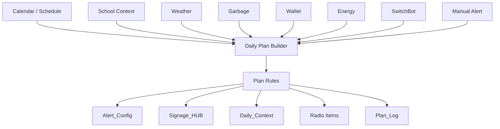

# Schedule Alert Integration Design

## Summary

Schedule-derived alerts should be generated on the GAS side and stored in the existing `Alert_Config` sheet so the current `alert_check` polling path can stay unchanged.

The safest MVP is a daily/manual sync function that reads existing schedule context, creates only missing alert rows, and marks them with a schedule-specific `source` value. Runtime playback should continue to use `getAlertItemsForNow_()` and the existing `Alert_Config` lifecycle.

## Existing Data Sources

- `signage-assets/index.html`
  - Top portal links `schedule` to `calendar/`.
  - Existing `alert_check` polling already calls the signage-main-api with `device`.
- `signage-assets/calendar/index.html`
  - Uses JSONP against a separate calendar GAS endpoint.
  - Calls `?start=YYYY-MM-DD&end=YYYY-MM-DD` and receives `events` plus `holidays`.
  - Event shape is inferred from frontend use: `title`, `start`, `end`, `allDay`.
  - School events are detected by titles starting with `🏫`.
- `signage-assets/schedule/index.html`
  - Embeds Google Calendar directly in iframes.
  - Good for display, not a practical backend source.
- `signage-main-api/Code.js`
  - `SS_SIGNAGE_ID` points to the main signage spreadsheet.
  - `HUB_SHEET_NAME = 'Signage_HUB'`.
  - `readHubRowForToday_()` reads today's `Signage_HUB` row by `date`.
  - `readHubRowByDate_(d)` reads a specific date from `Signage_HUB`.
  - Hub fields used today include `weather_short`, `garbage_short`, `lunch_short`, `school_short`, `wallet_short`, `mode`, and `is_school_day`.
  - `getPenoText_(slot, now)` reads `Daily_Context` from `PENO_SS_ID`, using date column A and message column E.
  - Existing school-related audio flow uses `INTRO_SCHOOL_TODAY`, `INTRO_SCHOOL_TOMORROW`, `SCHOOL_GEAR_WEEKSTART`, and Peno TTS.
- Names searched but not directly referenced in the current `signage-main-api` files:
  - `Fact_Schedule`
  - `Today_Board`
  - `View_WeekAgenda`
  - `Calendar_Dim`

## Current Alert Architecture

- `Alert_Config` stores alert rows with columns such as `id`, `enabled`, `status`, `category`, `mode`, `scenario`, `kind`, `date`, `fire_time`, `fire_datetime`, `message`, `item_type`, `key`, `speaker`, `expires_at`, `created_by`, and `source`.
- `setAlert_(params)` appends one or more rows to `Alert_Config`.
- `getAlertItemsForNow_(now, device)` reads waiting rows whose `fire_datetime` is due, returns radio `items`, then marks rows as `played`.
- `buildAlertRecord_(args)` already handles WAV/TTS fallback:
  - WAV key found: `item_type = 'wav'`, `key = ...`
  - WAV key missing: `item_type = 'tts'`, `speaker = 'zunda'`, `message` is used
- `alertRowToItem_(row)` converts alert rows into `{ type:'wav', key }` or `{ type:'tts', speaker, text }`.

## Option A: Minimal Sync

Add a GAS function such as `syncScheduleAlerts_(date)` that creates normal `Alert_Config` rows from schedule information.

Flow:

1. Run `syncScheduleAlerts_(targetDate)` every morning, or expose it as a manual admin/API action.
2. Read schedule source for `targetDate`.
3. Match only known target events, for example school start.
4. Compute alert time, for example event start minus 40 minutes.
5. Insert rows into `Alert_Config` using the same row shape as `buildAlertRecord_()`.
6. Use `source = 'schedule_sync'` or `source = 'schedule_sync:school_departure'`.
7. Avoid duplicates by checking existing rows before append.

Possible sources:

- MVP source: `Signage_HUB`
  - Use `readHubRowByDate_(date)`.
  - Good when `is_school_day` and a school summary field are enough.
  - Weak if exact school start time is not present.
- Better source if available in the main spreadsheet: `Fact_Schedule` or `View_WeekAgenda`
  - Search did not find code references, so sheet schema needs confirmation.
  - Best if it contains event date/time/title rows.
- Calendar JSONP endpoint used by `calendar/index.html`
  - It already returns range events to the frontend.
  - Could be duplicated server-side in signage-main-api only if endpoint/API ownership is clear.

Duplicate prevention:

- Add deterministic identity in `source`, for example:
  - `source = 'schedule_sync:school_departure:2026-07-05:<eventIdOrHash>'`
- Before append, scan `Alert_Config` for same `date`, `category`, `kind`, `fire_datetime`, and `source`.
- If no stable event id exists, hash `date + title + start + offset_min + mode`.

Existing Alert distinction:

- Keep `created_by = 'schedule_sync'`.
- Keep `source` schedule-specific.
- Use normal categories such as `outing` and modes such as `school` to reuse WAV mapping.

## Option B: Rule Config

Add a new sheet, for example `Alert_Rule_Config`, to define schedule-to-alert rules.

Suggested columns:

```text
rule_id
enabled
target
source_type
match_keyword
offset_min
category
mode
kind
message
priority
source
```

Example:

```text
school_departure
true
living
schedule
🏫
-40
outing
school
depart
そろそろ学校に出る時間なのだ
100
schedule_rule
```

Flow:

1. Read enabled rules.
2. Read schedule events for a date range.
3. Match rules to events by source type and keyword.
4. Create alerts at `event_start + offset_min`.
5. Use deterministic duplicate keys per rule and event.

Pros:

- Non-code changes can adjust offsets and keywords.
- Multiple future use cases can be added without changing `Alert.js`.

Cons:

- Requires schema, validation, and admin/debug visibility.
- Needs a clear event source abstraction.

## Option C: Event/Rule Engine

Model all household facts as events, then apply rules.

Shape:

```text
Event -> Rule -> Alert
```

Possible event types:

- `schedule.school_start`
- `schedule.lesson`
- `weather.rain_pm`
- `school.closed`
- `garbage.tomorrow`
- `wallet.warning`
- `switchbot.temperature`

Rules would map events to alerts, TTS messages, WAV keys, and target devices.

Pros:

- One mechanism for school, weather, calendar, finance, and home sensors.
- Easier to debug if event/rule/action logs are added.

Cons:

- Much larger design and migration.
- Requires event normalization, rule evaluation, idempotency, and observability.

## Daily Plan Builder Concept

Schedule Alert Integration should eventually become one part of a broader Daily Plan Builder. The goal is not only to create schedule-derived alerts, but to assemble the day's display, speech, reminders, and debug information from multiple household data sources.

```text
Sources
  Calendar
  School
  Weather
  Garbage
  Wallet
  Energy
  SwitchBot
  Manual Alert

↓ buildDailyPlan_(targetDate)

Outputs
  Alert_Config
  Signage_HUB
  Daily_Context
  Radio Items
  Admin Debug
```

This should be a `Daily Plan`, not a `Morning Build`. Household events can happen throughout the day:

- Morning school departure and outing preparation.
- Midday gakudo, lessons, and other schedule changes.
- Evening preparation for tomorrow.
- Night sleep preparation.
- Manual timers and reminders.
- Weather, wallet, energy, or home-device warnings.

`Alert_Config` is only one output path of the Daily Plan Builder. Future outputs may include:

```text
Alert_Config
Signage_HUB
Daily_Context
Radio Items
Plan_Log
```

Suggested GAS function names:

```text
buildDailyPlan_(targetDate)
syncDailyPlanAlerts_(targetDate)
```

Suggested sheet names:

```text
Daily_Plan
Plan_Rules
Plan_Log
```

Future architecture:



The current MVP can still start with schedule alerts, but implementation names and module boundaries should avoid making schedule the only possible input source. A narrow `syncScheduleAlerts_()` can be useful initially, as long as it can later move under:

```text
buildDailyPlan_()
  └ syncDailyPlanAlerts_()
```

Daily Plan Builder is an initial implementation shape. Future versions may evolve into a Context Engine that continuously updates household context and re-evaluates rules throughout the day.

## Future Vision: Context Engine

`buildDailyPlan_(targetDate)` is a reasonable name and shape for the MVP or early implementation. However, the long-term system should not be a one-shot build that runs once and stops. Household context changes throughout the day, and the system should eventually re-evaluate when important inputs change.

Examples:

```text
天気が雨予報に変わる
学校予定が変更される
家計/財布状態が悪化する
SwitchBot温湿度が閾値を超える
手動Alertが追加される
```

Future concept names:

```text
Context Engine
Daily Planning Engine
```

Future architecture:

```text
Sources
  Calendar
  School
  Weather
  Garbage
  Wallet
  Energy
  SwitchBot
  Manual

↓
Context Engine

↓
Rule Engine

↓
AI Decision

↓
Outputs
  Alert_Config
  Signage_HUB
  Daily_Context
  Radio Items
  Dashboard
  Plan_Log
```

Rules should be the central decision layer, not only a Schedule integration mechanism. They translate household events into alerts, radio items, dashboard state, and logs.

Examples:

```text
IF weather.rain_pm
THEN alert umbrella reminder

IF schedule.school_start
THEN alert departure reminder offset -40min

IF wallet.weekly_remaining < threshold
THEN night radio warning
```

AI Decision can be introduced later as a layer that generates wording or judgment from context. It should not be part of the first implementation. The first implementation should be Rule Engine centered, with boundaries that allow AI judgment to be inserted later.

```text
Context Engine
↓
AI Decision
↓
Daily_Context
↓
Peno/Shimao Radio
```

`Daily_Context` should eventually be treated as an output of the Context Engine and AI Decision, not as the primary source of truth.

```text
Sources
↓
Context Engine
↓
Daily_Context
↓
Radio
```

Internal future concept note:

```text
FamilyOS
```

This is not a formal product name today. It is a shorthand for the future idea that Signage is the display/playback frontend, while the main system is a household Context Engine that integrates schedule, environment, wallet, school, and manually entered alert information.

## Recommended MVP

Start with Option A.

Implement `syncScheduleAlerts_(targetDate)` in `Alert.js` or a new `ScheduleAlert.js`, but have it write ordinary `Alert_Config` rows. Do not change `getAlertItemsForNow_()` or frontend polling.

Recommended MVP remains Option A, but it should be treated as the first output path of a future Daily Plan Builder. The implementation should avoid naming and structure that makes schedule the only possible input source.

Recommended first rule:

- Source: `Signage_HUB` if it has a reliable school start/departure time field; otherwise use the calendar event source.
- Match: school event or school-day row.
- Alert: `category='outing'`, `mode='school'`, `kind='depart'`.
- Fire time: school start minus configured offset, initially 40 minutes.
- Message fallback: `そろそろ学校に出る時間なのだ`.
- Source: `schedule_sync:school_departure`.

## Risks

- Exact school start time may not exist in `Signage_HUB`.
- `Fact_Schedule`, `Today_Board`, `View_WeekAgenda`, and `Calendar_Dim` were not referenced in the current `signage-main-api` files, so their schemas need confirmation.
- Calendar display endpoint is separate from signage-main-api; duplicating that dependency may create ownership and token issues.
- Duplicate prevention must be deterministic or daily sync will create repeated alerts.
- If a schedule changes after sync, stale alerts need disable/update behavior.
- Timezone handling must be explicit; all existing UI assumes Asia/Tokyo behavior.

## Implementation Steps

1. Confirm which sheet contains exact schedule times for school start.
2. Add a read-only helper to list schedule events for a target date.
3. Add an idempotency helper that checks existing `Alert_Config` rows by `source`.
4. Add `syncScheduleAlerts_(targetDate)` that writes schedule-derived alerts.
5. Add a manual API action such as `action=syncScheduleAlerts` for admin testing.
6. Add a time-based Apps Script trigger after the behavior is verified.
7. Add list/debug output showing created, skipped duplicate, and skipped missing-time counts.

## Open Questions

- Which sheet is authoritative for school start time: `Signage_HUB`, `Fact_Schedule`, `Today_Board`, `View_WeekAgenda`, or the calendar endpoint?
- Is there a stable event id available for duplicate prevention?
- Should schedule changes update existing waiting alerts, or only create missing ones?
- Should sync run every morning, on calendar update, or only when admin triggers it?
- Which device targets should schedule alerts use by default?
- Should departure offset be globally fixed or per child/event/rule?
